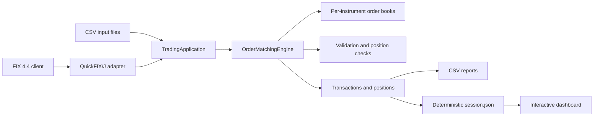
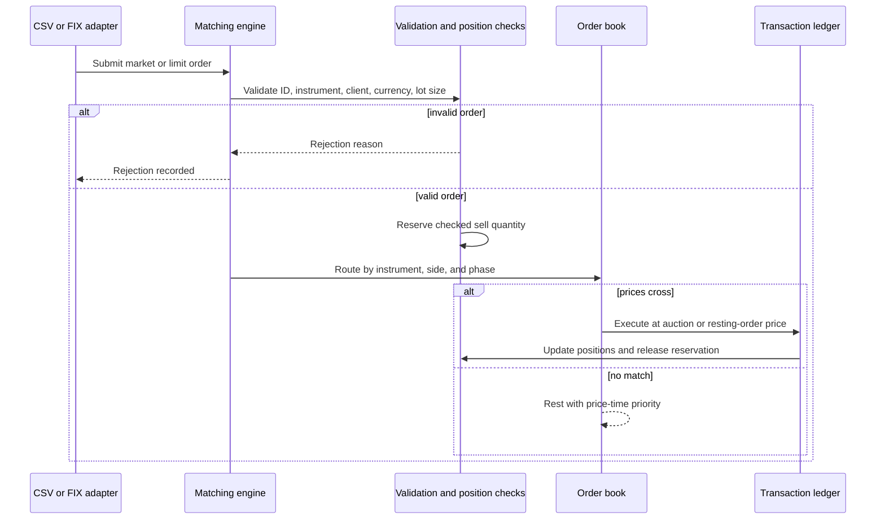
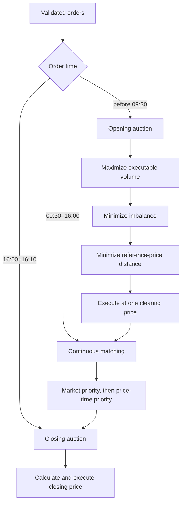

# Architecture

LimitForge is a single-process educational exchange simulator. Its core is a
Java matching engine; CSV and FIX are input adapters, CSV/JSON reports are
output adapters, and the web dashboard renders a committed engine-generated
session snapshot.

## System context

The matching engine does not depend on CSV, FIX, or the dashboard. Adapters
translate external data into domain objects and read results through explicit
engine accessors.

## Order lifecycle

An accepted order moves from `NEW` to `PARTIALLY_FILLED` or `FILLED` as its
remaining quantity changes. Invalid or risk-failing orders become `REJECTED`.

## Trading phases

Auction tie-breaking is deterministic: executable volume, imbalance,
reference-price distance, then the higher price. Continuous limit-limit trades
execute at the older resting order's price; market orders execute against the
available opposing limit price.

## Core invariants

- Order IDs are unique for the lifetime of an engine instance.
- Limit prices use `BigDecimal`; market orders carry an explicit order type.
- Quantities must be positive and conform to the instrument lot size.
- Price priority precedes time priority; order ID is the deterministic final tie-breaker.
- Position-checked sell orders reserve available quantity before entering a book.
- Each execution updates both counterparties and the transaction ledger under one write lock.
- Reports and the dashboard fixture are deterministic for a fixed input set.

## Concurrency model

- Per-instrument books use `PriorityBlockingQueue` for thread-safe queue access.
- Client, instrument, price, and reservation indexes use concurrent maps.
- Remaining order quantity uses `AtomicInteger`.
- Transaction and position mutation is coordinated with a write lock and synchronized client updates.
- Auction clearing-price calculations can run in parallel across instruments.

The public application currently submits a batch into one engine instance. The
concurrent data structures protect shared state and prepare the design for
multiple instruments, but this is not yet a horizontally scalable or
distributed matching architecture.

## Repository map

| Area | Responsibility |
| --- | --- |
| `model` | Orders, clients, instruments, and transactions |
| `engine` | Validation, auctions, continuous matching, positions |
| `csv` | Deterministic input and report adapters |
| `fix` | QuickFIX/J session adapter and New Order Single conversion |
| `report` | Machine-readable dashboard snapshot |
| `benchmark` | Reproducible end-to-end batch benchmark |
| `ui` | Read-only visualization and execution replay |

## Deliberate limitations

- No database, durable event log, recovery journal, or replication.
- No REST/WebSocket order-entry or live market-data API.
- FIX support is an experimental adapter for New Order Single messages with
  acceptance/rejection reports; it is not a complete exchange FIX gateway.
- The dashboard consumes a committed sample snapshot, not a live engine process.
- The benchmark excludes transport, persistence, FIX parsing, and external concurrency.

These boundaries keep the project useful as a transparent reference
implementation. The next architectural step is an event/API boundary between
the engine and external clients, followed by persistence and recovery.
